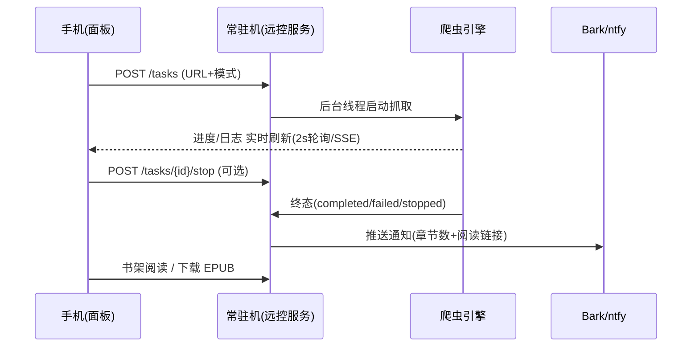

# 小说爬虫 · 手机远控使用教程

> **一句话**：让家里那台电脑（常驻机）跑一个轻量 Web 服务，你的手机浏览器打开一个网址，
> 就能**发抓取任务、看实时进度、读已抓的小说、下载 EPUB、收完成推送**——人不在电脑前也能指挥爬虫干活。
>
> 适用版本：**v2.4.16 及以上**（远控三期完整形态）。仅供个人学习研究使用，请遵守目标网站
> 服务条款并合理控制抓取频率。

---

## 目录

- [一、功能概述](#一功能概述)
- [二、核心特性](#二核心特性)
- [三、系统环境要求](#三系统环境要求)
- [四、安装与启动](#四安装与启动)
- [五、操作指南](#五操作指南)
- [六、常见问题 FAQ](#六常见问题-faq)
- [七、故障排除](#七故障排除)
- [八、安全与合规须知](#八安全与合规须知)

---

## 一、功能概述

远控 = 常驻机上的一条 **FastAPI Web 服务**（默认端口 `8760`）+ 手机浏览器里的**单页面板**。
它和桌面客户端共享同一套数据文件（书架 / 抓取结果 / 检查点），但**进程独立、互不干扰**。

```
┌──────────────┐   Tailscale 加密隧道 / 局域网    ┌──────────────────────────┐
│   你的手机    │ ───────────────────────────────► │        常驻机 (家里)       │
│  任意浏览器   │   https://机器名.ts.net          │  ┌────────────────────┐  │
│              │ ◄─────────────────────────────── │  │  远控服务 (8760)     │  │
│  发任务/读书  │        面板 + JSON 数据           │  │  ├─ 任务管理        │  │
│              │                                  │  │  ├─ 实时日志        │  │
└──────────────┘                                  │  │  ├─ 书架/阅读/EPUB  │  │
                                                  │  │  └─ 完成推送        │  │
        ┌──────────┐                              │  └────────┬───────────┘  │
        │ Bark/ntfy│ ◄────────────────────────────┼───────────┘              │
        │  手机通知 │      抓取完成/失败推送         │   爬虫引擎 + 抓取结果/     │
        └──────────┘                              │   书架 / 检查点文件        │
                                                  └──────────────────────────┘
```

**两种运行形态**（二选一即可，都读同一份 `数据/远控配置.json`）：

| 形态 | 启动方式 | 适合场景 |
|---|---|---|
| **桌面客户端内嵌** | 打开桌面 GUI，顶栏"远控"开关 | 电脑前用 GUI、偶尔手机看一眼 |
| **独立常驻服务** | 双击 `启动远控.bat`（或 `python -m 远控`） | 无人值守挂机，配开机自启 + 崩溃守护 |

> 注意：桌面客户端与独立服务**同时开**会抢占 8760 端口（后启动的一方失败，只记日志不报错弹窗）。
> 二者任务列表**相互独立**——手机发的任务不会出现在桌面 GUI 里，反之亦然。

---

## 二、核心特性

| 特性 | 说明 |
|---|---|
| 📡 **远程发任务** | 手机粘贴小说目录页 URL，选"完整抓取 / 测试（前 3 章）"，支持断点续传与导出 EPUB 开关 |
| 📊 **实时进度与日志** | 任务列表 2 秒自动刷新；可展开单任务实时日志（SSE 流式，断线自动重连） |
| ⏹ **远程停止** | 一键中断任务；已抓进度有检查点，不丢 |
| 🔁 **中断恢复** | 服务重启后，未完成任务自动识别为 `interrupted`，点"续传"接着抓（续写原文件） |
| 📚 **书架与在线阅读** | 手机直接阅读已抓的 txt：目录 / 翻章 / 字号 / 夜间模式，**阅读进度双端记忆**（换设备跟人走） |
| 📥 **EPUB 按需下载** | 书架一键生成并下载 EPUB（txt 更新后自动重新生成） |
| 🔔 **完成推送** | 任务结束时推 Bark（iOS）/ ntfy（安卓）通知，消息带章节数与阅读直达链接 |
| 🔒 **安全默认** | token 首启自动生成 + 常时比较；默认仅监听 `127.0.0.1`；EPUB 按 id 反查杜绝路径穿越；页面动态内容全 `textContent` 渲染防 XSS |

---

## 三、系统环境要求

**常驻机（跑服务的一方）**

| 项目 | 要求 |
|---|---|
| 操作系统 | Windows 10/11（Linux/macOS 理论可用，脚本按 Windows 编写） |
| 程序 | 小说爬虫 **EXE**（推荐）或源码 + Python 3.10+ 虚拟环境 |
| 依赖 | fastapi / uvicorn（源码模式首次运行 `启动远控.bat` 会自动安装） |
| 端口 | 默认 `8760`（可在 `数据/远控配置.json` 改） |
| 网络 | 本机回返必通；手机访问需 Tailscale（推荐）或局域网/直连 |

**手机（访问的一方）**

| 项目 | 要求 |
|---|---|
| 浏览器 | 任意现代手机浏览器（Safari / Chrome / Edge 均可） |
| 网络 | 与常驻机同 Tailscale 网络（推荐），或同局域网 |
| 可选 | ntfy App（安卓推送）/ Bark App（iOS 推送） |

---

## 四、安装与启动

### 4.1 EXE 用户（推荐，零配置）

1. 从 [Releases](https://github.com/HHH-SABER/book-crawler/releases) 下载 `novel-crawler-v*.exe`，放到任意目录；
2. 双击运行 → 桌面客户端打开，**远控服务已内嵌启动**（顶栏"远控"按钮显示 `远控开`）；
3. 首次运行会自动生成配置与 token（见 [4.4](#44-首次启动生成了什么)）。

### 4.2 源码用户

```bat
:: 1. 准备虚拟环境 (已有 .venv 可跳过)
python -m venv .venv
.venv\Scripts\pip.exe install -r requirements.txt

:: 2. 启动独立常驻服务 (自动补装 fastapi/uvicorn)
启动远控.bat
```

控制台会打印：

```
[远控] 服务地址 : http://127.0.0.1:8760/
[远控] 访问 token: <32位十六进制>   ← 记下它, 手机首次访问要输
```

### 4.3 常驻化（开机自启 + 崩溃自动拉起，挂机推荐）

| 脚本 | 作用 |
|---|---|
| `脚本\远控守护.bat` | 服务退出 **5 秒后自动拉起**（循环守护；手动 Ctrl+C 也不会连带关守护） |
| `脚本\安装远控服务.bat` | 注册 **Windows 登录时自启**（schtasks，免管理员）；加参数 `卸载` 即撤销 |

推荐组合：`安装远控服务.bat`（开机自启）+ 系统里让守护脚本随登录启动。

### 4.4 首次启动生成了什么

| 文件 | 位置（状态根目录下） | 内容 |
|---|---|---|
| `数据/远控配置.json` | `%LOCALAPPDATA%\小说爬虫\数据\` | `启用 / 端口(8760) / 绑定(127.0.0.1) / token / 外链前缀 / 推送` |
| `数据/阅读进度.json` | 同上 | 在线阅读进度（自动生成） |

> token 丢了怎么办：打开上述 JSON 文件查看 `token` 字段即可（删除 token 字段并重启服务可重新生成）。

---

## 五、操作指南

### 5.1 第一步：让手机能访问常驻机

服务默认**只监听本机**（`127.0.0.1`，安全默认），手机要访问需二选一：

**方式 A（推荐）— Tailscale 反代**（自带 HTTPS，仅你的设备可见，无需改配置）

```powershell
# 常驻机执行 (手机与常驻机登录同一 Tailscale 账号)
tailscale serve --bg 8760
```

手机浏览器打开：`https://<机器名>.<你的tailnet>.ts.net/`

**方式 B — 直连**（同局域网或 Tailscale IP）

1. `tailscale ip -4` 查到常驻机 IP（形如 `100.x.x.x`），或用局域网 IP；
2. 编辑 `数据/远控配置.json`，把 `"绑定": "127.0.0.1"` 改为该 IP；
3. 重启服务，手机访问 `http://100.x.x.x:8760/`。

### 5.2 面板速览

手机打开地址后，首次会弹出 token 输入框（存本机浏览器，之后免输）：

| 区域 | 功能 |
|---|---|
| **顶部输入卡** | 目录页 URL 输入框 + 模式（完整抓取/测试）+ 断点续传/导出 EPUB 开关 + **开始抓取** |
| **任务列表** | 任务/状态/进度/耗时/操作，**2 秒自刷**；点任务展开实时日志，"停"可中断 |
| **书架（抓取结果）** | 已抓书目列表，每本带 **阅读** 与 **EPUB** 两个按钮 |

### 5.3 日常操作：发一个抓取任务

1. 在小说网站复制**目录页**（章节列表页）URL；
2. 面板粘贴 URL → 选模式（不熟悉的新站先选"测试"只抓 3 章）→ 点 **开始抓取**；
3. 任务列表立即出现新任务，进度实时跳动；点任务名展开日志可看引擎/反爬/质检细节；
4. 抓完的书出现在下方**书架**。

### 5.4 在线阅读与 EPUB

- 书架点 **阅读** → 内置阅读页：章节目录、上下翻章、字号调节、日/夜间模式；
- **进度自动记住**：手机看到第几章，换平板接着看（进度存在常驻机，跟账号走）；
- 书架点 **EPUB** → 按需生成并下载（同一本书 txt 没变不会重复生成）。

### 5.5 中断续传（interrupted）

服务重启或异常退出后，未完成的任务会在任务列表以 **interrupted** 状态出现：

- 点 **续传** → 以断点续传模式重新拉起，**续写原文件**（不会另存"书名(1).txt"）；
- 点 **忽略** → 仅从列表移除展示，不动已抓文件。

### 5.6 完成推送（Bark / ntfy）

编辑 `数据/远控配置.json`，改完**重启服务**生效：

```jsonc
{
  "外链前缀": "https://<机器名>.<tailnet>.ts.net",   // 填了则推送带"点此阅读"直达链接
  "推送": {
    "bark": { "启用": true, "地址": "https://api.day.app/<你的key>" },   // iOS
    "ntfy": { "启用": true, "服务器": "https://ntfy.sh", "主题": "我的抓书频道" }  // 安卓
  }
}
```

- 安卓：装 [ntfy App](https://ntfy.sh) → 订阅同名主题；
- iOS：装 Bark → 把你的推送地址填入；
- 推送内容含 **成绩（章节数）** 与阅读直达链接；重复终态**自动去重**；`interrupted` 项不会误推。

### 5.7 任务的完整生命周期



### 5.8 API 一览（进阶，普通用户可跳过）

除 `healthz` 与面板外均需鉴权：`Authorization: Bearer <token>` 或 `?k=<token>`。

| 方法 | 路径 | 说明 |
|---|---|---|
| GET | `/api/v1/healthz` | 健康检查（免鉴权，供看门狗/守护脚本用） |
| POST | `/api/v1/tasks` | 发任务 `{url, mode?, resume?, export_epub?}` |
| GET | `/api/v1/tasks` | 任务列表（含进度/状态/耗时） |
| GET | `/api/v1/tasks/{id}/logs?after=N` | 日志增量（带截断标志，防漏日志） |
| GET | `/api/v1/tasks/{id}/logs/stream` | 日志 SSE 实时流 |
| POST | `/api/v1/tasks/{id}/stop` | 停止任务 |
| GET | `/api/v1/books` | 书架（扫 `抓取结果/*.txt`） |
| GET | `/api/v1/books/{id}/epub` | EPUB 按需生成下载 |

在线阅读页的章节/内容/进度接口由页面自动调用，无需手动拼。

---

## 六、常见问题 FAQ

**Q1：手机打开页面提示输入 token，token 在哪？**
常驻机 `%LOCALAPPDATA%\小说爬虫\数据\远控配置.json` 里的 `token` 字段。输入一次后存进浏览器，之后免输。

**Q2：桌面客户端开着，手机却连不上 8760？**
确认顶栏"远控"开关处于 `远控开`；`healthz` 自检：`curl http://127.0.0.1:8760/api/v1/healthz`。若与独立服务同时启动，端口被占的一方不会启动——**只保留一个入口**。

**Q3：手机发的任务，桌面 GUI 里看不到（或反之）？**
正常现象。桌面客户端与独立远控服务是两个进程，**任务列表各自独立**；书架/历史/检查点等数据文件是共享的。

**Q4：任务显示 failed，怎么定位原因？**
点任务展开日志，关注 `[反爬]`、`[引擎]`、`[质检]` 关键字：常见为站点反爬命中（降速重试）、选择器失效（换站测试）或 URL 不是目录页。

**Q5：续传为什么是"续写原文件"，会不会另存一个副本？**
续传以 `resume + unique_title=false` 拉起，专为保证**续写原文件**设计；若发现"书名(1).txt"类副本，说明用了不带该参数的入口。

**Q6：收不到完成推送？**
依次检查：`推送.<渠道>.启用` 是否 true → 手机 App 是否订阅成功（ntfy 先用网页发一条测试）→ **改完配置是否重启了服务** → iOS Bark 地址是否完整（含你的 key）。

**Q7：EPUB 下载 404？**
书架列表按 `抓取结果/*.txt` 实时扫描，文件被移动/改名后旧 id 失效——刷新书架再点。

**Q8：阅读进度能跨设备同步吗？**
能。进度存常驻机（`数据/阅读进度.json`），任何设备登录同一面板即接着上次读。

**Q9：公网能直接暴露这个服务吗？**
**强烈不建议**。请走 Tailscale（自带加密、仅 tailnet 可见）；面板与接口虽有多层防护，但暴露公网会显著增大攻击面。

---

## 七、故障排除

**排查三板斧**（按顺序）：

```powershell
:: ① 服务活着吗 (免鉴权)
curl http://127.0.0.1:8760/api/v1/healthz

:: ② 端口被谁占着
netstat -ano | findstr :8760

:: ③ 看服务日志 (独立模式看控制台; 内嵌模式看 日志/ 目录)
```

| 症状 | 可能原因 | 解决 |
|---|---|---|
| `healthz` 连不上 | 服务未启动 / 启动即崩 | 见上方①②；独立模式看控制台报错；确认 `远控配置.json` 的 `启用` 为 `true` |
| 端口被占用 | 桌面客户端与独立服务同时开 | 关掉一个，或改 `端口` 字段错开 |
| 手机 401 | token 错 / 未带 token | 重新输入 token；或 URL 带 `?k=<token>` |
| 手机打不开页面 | 服务只监听 127.0.0.1 | 用 [5.1](#51-第一步让手机能访问常驻机) 方式 A/B 暴露给手机 |
| `tailscale serve` 后 HTTPS 打不开 | 常驻机 Tailscale 未登录 / 版本旧 | `tailscale status` 检查；升级 Tailscale |
| 任务一直 pending | 爬虫线程未拉起 | 看日志 `task_manager` 相关报错；确认 `抓取结果` 目录可写 |
| 日志展开为空 | 日志被 500 条截断 | 面板会自动重置指针，稍等片刻或刷新页面 |
| 推送重复/不推 | 属正常去重 / 配置未生效 | 重复终态只推一次；改配置后**重启服务** |
| 服务反复自动重启 | 守护脚本在拉起崩溃的服务 | 先 `安装远控服务.bat 卸载` 或关守护，修好根因再开 |

---

## 八、安全与合规须知

- **token 即钥匙**：拿到 token = 可操控常驻机爬虫与读取书架。勿截图外传；怀疑泄露就删掉 JSON 里的 `token` 字段重启服务（所有设备需重新输入）。
- **默认最小暴露**：服务默认仅 `127.0.0.1`；任何"让手机访问"的操作都是在主动扩大暴露面，请优先 Tailscale。
- **本项目仅供个人学习研究**：抓取内容版权归原作者所有，请在下载后 24 小时内删除；合理控制频率，避免对目标站点造成压力。

---

*文档版本：v1.0（2026-09-11，对应 v2.4.16+ 三期形态）· 更多设计细节见 [手机远控方案设计.md](手机远控方案设计.md)*
